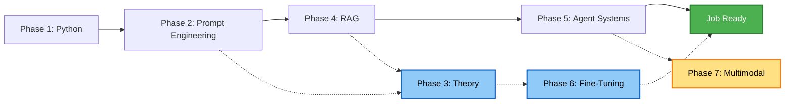

# 🚀 AI Agent Development Learning Path

> **A curated, hands-on roadmap from zero to production-grade AI Agents.**  
> Focus on **RAG** and **Agent Systems** — the two most in-demand skills for AI application engineers.

[简体中文](README.md)

---

## 🗺️ Roadmap Overview

| Phase | Topic | Goal | Project |
|:---:|---|---|---|
| **1** | Python & Backend | Master Python advanced features, FastAPI, Streamlit | `Basic Chatbot` |
| **2** | Prompt Engineering & Low-Code | Learn to control AI with natural language; prototype with Coze/Dify | `Interview Agent` |
| **3** | LLM Theory & NLP | Understand Transformer architecture, PyTorch, HuggingFace | `Text Classifier` |
| **4** | Advanced RAG | Connect LLMs to private data; eliminate hallucinations | `HR Resume RAG` |
| **5** | Agent Systems | Build AI that plans, acts, and collaborates | `Smart Voyage Agent` |
| **6** | Fine-Tuning & Deploy | Tailor models for vertical domains; production deployment | `Domain NER Model` |
| **7** | Multimodal & AIGC | Expand into images and vision *(optional)* | `Style Image Generator` |

### Suggested Learning Order

> **💡 Strategy:** Follow the solid arrows first to get job-ready quickly. Return to dashed phases for deeper theory and specialization.

---

## 📋 The Path

Click any phase below to expand its goals, resources, and project requirements.

<b>Phase 1: Python & Backend Foundations</b> 🐍

### Goals
- [ ] Write advanced Python (OOP, decorators, concurrency)
- [ ] Build RESTful APIs with **FastAPI**
- [ ] Handle data cleaning with **Pandas** and **SQL**
- [ ] Create quick web UIs for AI demos with **Streamlit**

### Resources
| Type | Resource |
|---|---|
| **Video** | [黑马程序员 - Python 全套教程](https://www.bilibili.com/video/BV1qW4y1a7fU) |
| **Video** | [FastAPI Full Course](https://www.youtube.com/watch?v=0sOvCWFmrtA) |
| **Book** | *Fluent Python* (2nd Edition) — decorators, generators, concurrency |
| **Docs** | [FastAPI 官方中文文档](https://fastapi.tiangolo.com/zh/) · [Streamlit Docs](https://docs.streamlit.io/) |

### Project: Basic Chatbot
Build a ChatGPT-like web chat app using **Python + Streamlit + any LLM API**.

- Multi-turn conversation with context memory
- Clean UI with chat history display
- *(Optional)* Streaming output, model switching, history clear button

<b>Phase 2: Prompt Engineering & Low-Code Agents</b> 💬

### Goals
- [ ] Write advanced prompts (Zero-shot, Few-shot, Chain-of-Thought)
- [ ] Build workflows on **Coze** (plugins, multi-agent orchestration)
- [ ] Deploy enterprise apps with **Dify** (knowledge base, Docker private deployment)
- [ ] Run local models with **Ollama** (DeepSeek, Qwen)

### Resources
| Type | Resource |
|---|---|
| **Video** | [吴恩达 - ChatGPT Prompt Engineering](https://www.bilibili.com/video/BV1Mo4y1p7iH) |
| **Video** | [Dify Official Tutorials](https://www.youtube.com/@DifyAI) |
| **Guide** | [Prompt Engineering Guide](https://www.promptingguide.ai/zh) · [Dify Docs](https://docs.dify.ai/v/zh-hans) |

### Project: Interview Agent
Build a resume-aware mock interviewer on **Coze** or **Dify**.

- Parse uploaded resume and ask relevant technical questions
- Multi-round dialogue with adaptive follow-ups
- *(Optional)* Export conversation history

<b>Phase 3: LLM Theory & NLP Fundamentals</b> 🧠

### Goals
- [ ] Grasp deep learning basics and build simple networks in **PyTorch**
- [ ] Understand NLP concepts: tokenization, word embeddings
- [ ] Master the **Transformer** architecture (Encoder, Decoder, Self-Attention)
- [ ] Navigate the **HuggingFace** ecosystem (download, load, run models)

### Resources
| Type | Resource |
|---|---|
| **Video** | [Andrej Karpathy - Let's build GPT from scratch](https://www.youtube.com/watch?v=kCc8FmEb1nY) |
| **Video** | [3Blue1Brown - Neural Networks](https://www.bilibili.com/video/BV1bx411M7Zx) |
| **Article** | [The Illustrated Transformer](https://jalammar.github.io/illustrated-transformer/) |
| **Course** | [Hugging Face NLP Course](https://huggingface.co/learn/nlp-course/zh-CN/chapter1/1) |

### Project: Text Classifier
Build a news text classification system using **PyTorch + BERT or FastText**.

- Train / validation / test split with proper evaluation (F1, Recall)
- Load a pre-trained model from HuggingFace
- *(Optional)* Deploy as a FastAPI inference endpoint

<b>Phase 4: Advanced RAG Systems</b> 🔍 ⭐

### Goals
- [ ] Master **LangChain** core components (Models, Prompts, Memory, Chains)
- [ ] Implement document parsing, chunking strategies, and embedding
- [ ] Use vector databases (**Milvus**, **Faiss**, **Chroma**) for semantic search
- [ ] Apply advanced optimizations: query rewriting, reranking, hybrid retrieval

### Resources
| Type | Resource |
|---|---|
| **Video** | [吴恩达 - LangChain for LLM Application Development](https://www.bilibili.com/video/BV1Ku4y1T7qz) |
| **Video** | [RAG Advanced Techniques](https://www.bilibili.com/video/BV15c411F7Z1) |
| **Docs** | [LangChain Python Docs](https://python.langchain.com/docs/get_started/introduction) · [Milvus Docs](https://milvus.io/docs/zh-CN) |
| **Model** | [BGE M3 Embedding](https://huggingface.co/BAAI/bge-m3) — best open-source multilingual embedding |

### Project: HR Resume RAG
Build an intelligent resume search system for recruiters.

- Parse heterogeneous resumes (PDF, Word) and chunk effectively
- Vector search + re-ranking for accurate candidate matching
- Multi-turn conversational filtering (e.g., "Who has the most Python experience?")

<b>Phase 5: Agent Systems & Multi-Agent Orchestration</b> 🤖 ⭐

### Goals
- [ ] Understand the **ReAct** paradigm (Thought → Action → Observation)
- [ ] Implement **Function Calling** and tool use (APIs, databases)
- [ ] Orchestrate complex workflows with **LangGraph** (state machines)
- [ ] Design **multi-agent** systems (router + specialized worker agents)

### Resources
| Type | Resource |
|---|---|
| **Course** | [DeepLearning.AI - AI Agents in LangGraph](https://learn.deeplearning.ai/courses/ai-agents-in-langgraph) |
| **Video** | [AutoGen vs CrewAI vs LangGraph](https://www.bilibili.com/video/BV1Jw411h7Z5) |
| **Docs** | [LangGraph Docs](https://langchain-ai.github.io/langgraph/) · [OpenAI Function Calling](https://platform.openai.com/docs/guides/function-calling) |
| **Paper** | [ReAct](https://react-lm.github.io/) |

### Project: Smart Voyage Agent
Build a multi-agent travel assistant using **LangGraph**.

- Parse complex user requests (e.g., "Check Beijing weather, then book a morning train")
- Route intents to specialized agents: Weather Agent, Ticketing Agent
- Summarize and format final output for the user

<b>Phase 6: Fine-Tuning & Private Deployment</b> 🛠️

### Goals
- [ ] Prepare and clean fine-tuning datasets (JSONL QA pairs)
- [ ] Apply **LoRA / QLoRA** for parameter-efficient fine-tuning
- [ ] Use **LLaMA-Factory** for streamlined training workflows
- [ ] Deploy with quantization and high-performance inference (**vLLM**)

### Resources
| Type | Resource |
|---|---|
| **Video** | [LLaMA-Factory 官方教学](https://www.bilibili.com/video/BV1hK421d74W) |
| **Video** | [LoRA & QLoRA Explained](https://www.youtube.com/watch?v=1YmO4f5E34s) |
| **Docs** | [LLaMA-Factory GitHub](https://github.com/hiyouga/LLaMA-Factory) · [vLLM Docs](https://docs.vllm.ai/en/latest/) |

### Project: Domain NER Model
Fine-tune an open-source model (e.g., Qwen-7B) for vertical-domain information extraction.

- Build a domain dataset (e.g., Traditional Chinese Medicine, legal documents)
- Fine-tune with LoRA using LLaMA-Factory
- Export merged weights and deploy via vLLM with OpenAI-compatible API

<b>Phase 7: Multimodal & AIGC (Optional)</b> 🎨

### Goals
- [ ] Learn computer vision basics (CNN, ResNet, YOLO)
- [ ] Understand **Stable Diffusion** and diffusion model principles
- [ ] Deploy **Stable Diffusion WebUI / ComfyUI** locally
- [ ] Apply advanced control: **ControlNet**, **LoRA** fine-tuning for styles

### Resources
| Type | Resource |
|---|---|
| **Video** | [秋叶 - Stable Diffusion 保姆级入门](https://www.bilibili.com/video/BV1iM4y1y7oA) |
| **Video** | [Hugging Face Diffusion Models Course](https://www.youtube.com/watch?v=sFztFnnclbg) |
| **Guide** | [Stable Diffusion Art Tutorials](https://stable-diffusion-art.com/) · [Diffusers Docs](https://huggingface.co/docs/diffusers/index) |

### Project: Style Image Generator
Build a multimodal app that generates styled images from text descriptions.

- Use an LLM to refine and optimize user prompts
- Call local Stable Diffusion with a specific style LoRA
- Display generated images in a simple web UI

---

## 💡 Practical Tips

1. **You don't need to buy GPUs.**  
   Rent on [AutoDL](https://www.autodl.com/) or [阿里云 PAI](https://www.aliyun.com/product/bigdata/pai) for ~¥50/day.

2. **Your GitHub is your resume.**  
   Don't just copy the sample projects — change the domain (e.g., medical → legal, travel → IT ops) to make them unique.

3. **Key interview topic:** How do you improve RAG recall?  
   Answer: **Rerank**, **hybrid search** (BM25 + dense), **query rewriting**.

4. **Stay connected.**  
   Follow [HuggingFace](https://huggingface.co/), [魔搭社区 (ModelScope)](https://www.modelscope.cn/), and [LangChain Blog](https://blog.langchain.dev/) for latest patterns.

---

**Keep building. Good luck on your probable adventure!** ⭐

