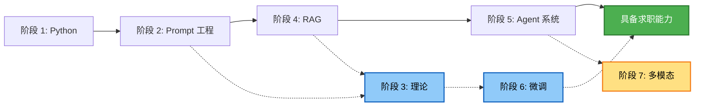

# 🚀 AI Agent 开发学习路径

> **一份精心策划的实战路线图，从零基础到生产级 AI Agent 开发。**  
> 聚焦 **RAG** 和 **Agent 系统** —— AI 应用工程师最紧缺的两大技能。

[English](README.md)

---

## 🗺️ 路线图概览

| 阶段 | 主题 | 目标 | 实战项目 |
|:---:|---|---|---|
| **1** | Python 与后端基础 | 掌握 Python 高阶特性、FastAPI、Streamlit | `简易对话机器人` |
| **2** | Prompt 工程与低代码 Agent | 学会用自然语言驾驭 AI；用 Coze/Dify 快速验证想法 | `面试助手 Agent` |
| **3** | 大模型理论与 NLP 基础 | 理解 Transformer 架构、PyTorch、HuggingFace 生态 | `文本分类器` |
| **4** | 进阶 RAG 系统 | 让大模型连接私有数据，消除幻觉 | `智能简历推荐系统` |
| **5** | Agent 系统与多智能体编排 | 构建能规划、能行动、能协作的 AI | `多意图旅行助手` |
| **6** | 微调与私有化部署 | 为垂直领域定制模型，具备生产级部署能力 | `领域信息抽取模型` |
| **7** | 多模态与 AIGC | 将 AI 能力拓展到图像与视觉 *(选修)* | `风格化图像生成器` |

### 推荐学习顺序

> **💡 学习策略：** 先沿着实线路径走，快速达到求职水平；虚线路径用于后续深造与专项突破。

---

## 📋 学习路径

点击任意阶段展开查看目标、推荐资源和实战项目要求。

<b>阶段 1：Python 与后端基础</b> 🐍

### 目标
- [ ] 掌握 Python 高阶语法（面向对象、装饰器、并发编程）
- [ ] 使用 **FastAPI** 构建 RESTful API
- [ ] 使用 **Pandas** 和 **SQL** 进行数据清洗
- [ ] 使用 **Streamlit** 为 AI 应用快速搭建 Web 界面

### 推荐资源
| 类型 | 资源 |
|---|---|
| **视频** | [黑马程序员 - Python 全套教程](https://www.bilibili.com/video/BV1qW4y1a7fU) |
| **视频** | [FastAPI Full Course](https://www.youtube.com/watch?v=0sOvCWFmrtA) |
| **书籍** | *Fluent Python*（第2版）——重点阅读装饰器、生成器与并发章节 |
| **文档** | [FastAPI 官方中文文档](https://fastapi.tiangolo.com/zh/) · [Streamlit 文档](https://docs.streamlit.io/) |

### 实战项目：简易对话机器人
使用 **Python + Streamlit + 任意大模型 API** 搭建一个类 ChatGPT 的网页聊天应用。

- 支持多轮对话与上下文记忆
- 界面简洁，包含聊天记录展示
- *(可选)* 流式输出、模型切换、清空历史按钮

<b>阶段 2：Prompt 工程与低代码 Agent</b> 💬

### 目标
- [ ] 掌握高阶提示词技巧（Zero-shot、Few-shot、思维链 COT）
- [ ] 在 **Coze** 上编排工作流与插件，实现多 Agent 协同
- [ ] 使用 **Dify** 构建企业级应用（知识库、Docker 私有化部署）
- [ ] 使用 **Ollama** 本地部署开源模型（DeepSeek、Qwen 等）

### 推荐资源
| 类型 | 资源 |
|---|---|
| **视频** | [吴恩达 - ChatGPT Prompt Engineering](https://www.bilibili.com/video/BV1Mo4y1p7iH) |
| **视频** | [Dify Official Tutorials](https://www.youtube.com/@DifyAI) |
| **指南** | [Prompt Engineering Guide](https://www.promptingguide.ai/zh) · [Dify 文档](https://docs.dify.ai/v/zh-hans) |

### 实战项目：面试助手 Agent
基于 **Coze** 或 **Dify** 搭建一个能读取简历的模拟面试官。

- 解析上传的简历，提出针对性的技术问题
- 多轮对话，根据回答自适应追问
- *(可选)* 导出对话记录

<b>阶段 3：大模型理论与 NLP 基础</b> 🧠

### 目标
- [ ] 掌握深度学习基础，能用 **PyTorch** 搭建简单神经网络
- [ ] 理解 NLP 核心概念：分词、词向量
- [ ] 深入理解 **Transformer** 架构（Encoder、Decoder、Self-Attention）
- [ ] 熟练使用 **HuggingFace** 生态（下载、加载、运行模型）

### 推荐资源
| 类型 | 资源 |
|---|---|
| **视频** | [Andrej Karpathy - Let's build GPT from scratch](https://www.youtube.com/watch?v=kCc8FmEb1nY) |
| **视频** | [3Blue1Brown - 深度学习之神经网络](https://www.bilibili.com/video/BV1bx411M7Zx) |
| **文章** | [The Illustrated Transformer](https://jalammar.github.io/illustrated-transformer/)（图解 Transformer） |
| **课程** | [Hugging Face NLP Course](https://huggingface.co/learn/nlp-course/zh-CN/chapter1/1) |

### 实战项目：文本分类器
使用 **PyTorch + BERT 或 FastText** 构建新闻文本分类系统。

- 划分训练集 / 验证集 / 测试集，使用 F1、Recall 等指标评估
- 从 HuggingFace 加载预训练模型
- *(可选)* 封装为 FastAPI 推理接口部署

<b>阶段 4：进阶 RAG 系统</b> 🔍 ⭐

### 目标
- [ ] 掌握 **LangChain** 核心组件（Models、Prompts、Memory、Chains）
- [ ] 实现文档解析、分块策略与向量化
- [ ] 使用向量数据库（**Milvus**、**Faiss**、**Chroma**）进行语义检索
- [ ] 应用高阶优化：Query 改写、重排序、混合检索

### 推荐资源
| 类型 | 资源 |
|---|---|
| **视频** | [吴恩达 - 基于 LangChain 的大模型应用开发](https://www.bilibili.com/video/BV1Ku4y1T7qz) |
| **视频** | [RAG 高级技巧详解](https://www.bilibili.com/video/BV15c411F7Z1) |
| **文档** | [LangChain Python 文档](https://python.langchain.com/docs/get_started/introduction) · [Milvus 中文文档](https://milvus.io/docs/zh-CN) |
| **模型** | [BGE M3 Embedding](https://huggingface.co/BAAI/bge-m3) —— 当前最佳开源多语言 Embedding 模型 |

### 实战项目：智能简历推荐系统
为 HR 构建一套智能简历检索系统。

- 解析多格式简历（PDF、Word），设计合理的文本切分策略
- 向量检索 + 重排序，实现精准候选人匹配
- 支持多轮对话筛选（例如："这些人里谁的 Python 经验最丰富？"）

<b>阶段 5：Agent 系统与多智能体编排</b> 🤖 ⭐

### 目标
- [ ] 深刻理解 **ReAct** 范式（Thought → Action → Observation）
- [ ] 实现 **Function Calling** 与工具调用（API、数据库）
- [ ] 使用 **LangGraph** 编排复杂工作流（状态机）
- [ ] 设计**多智能体**系统（路由 Agent + 专业 Worker Agent）

### 推荐资源
| 类型 | 资源 |
|---|---|
| **课程** | [DeepLearning.AI - AI Agents in LangGraph](https://learn.deeplearning.ai/courses/ai-agents-in-langgraph) |
| **视频** | [多智能体系统开发：AutoGen vs CrewAI vs LangGraph](https://www.bilibili.com/video/BV1Jw411h7Z5) |
| **文档** | [LangGraph 文档](https://langchain-ai.github.io/langgraph/) · [OpenAI Function Calling 指南](https://platform.openai.com/docs/guides/function-calling) |
| **论文** | [ReAct](https://react-lm.github.io/) |

### 实战项目：多意图旅行助手
使用 **LangGraph** 构建多 Agent 协同的旅行助手。

- 解析复杂用户需求（例如："查一下北京明天天气，再订一张上海出发的早班高铁"）
- 将意图路由给专业 Agent：天气 Agent、票务 Agent
- 汇总 Agent 整理最终结果并格式化输出

<b>阶段 6：微调与私有化部署</b> 🛠️

### 目标
- [ ] 准备与清洗微调数据集（JSONL 格式 QA 对）
- [ ] 掌握 **LoRA / QLoRA** 参数高效微调技术
- [ ] 使用 **LLaMA-Factory** 简化训练流程
- [ ] 模型量化与高性能推理部署（**vLLM**）

### 推荐资源
| 类型 | 资源 |
|---|---|
| **视频** | [LLaMA-Factory 官方教学：从零微调大模型](https://www.bilibili.com/video/BV1hK421d74W) |
| **视频** | [LoRA & QLoRA Explained](https://www.youtube.com/watch?v=1YmO4f5E34s) |
| **文档** | [LLaMA-Factory GitHub](https://github.com/hiyouga/LLaMA-Factory) · [vLLM 文档](https://docs.vllm.ai/en/latest/) |

### 实战项目：领域信息抽取模型
基于开源模型（如 Qwen-7B），使用 LoRA 微调实现垂直领域信息抽取。

- 构建领域数据集（如中医药文本、法律文书）
- 使用 LLaMA-Factory 进行 LoRA 微调
- 合并权重，通过 vLLM 部署为兼容 OpenAI API 格式的服务

<b>阶段 7：多模态与 AIGC（选修）</b> 🎨

### 目标
- [ ] 了解计算机视觉基础（CNN、ResNet、YOLO）
- [ ] 理解 **Stable Diffusion** 与扩散模型原理
- [ ] 本地部署 **Stable Diffusion WebUI / ComfyUI**
- [ ] 进阶控制：**ControlNet**、**LoRA** 风格微调

### 推荐资源
| 类型 | 资源 |
|---|---|
| **视频** | [秋叶 - Stable Diffusion 保姆级入门教程](https://www.bilibili.com/video/BV1iM4y1y7oA) |
| **视频** | [Hugging Face Diffusion Models Course](https://www.youtube.com/watch?v=sFztFnnclbg) |
| **指南** | [Stable Diffusion Art Tutorials](https://stable-diffusion-art.com/) · [Diffusers 文档](https://huggingface.co/docs/diffusers/index) |

### 实战项目：风格化图像生成器
构建一个多模态应用，根据文本描述生成特定风格的图像。

- 使用大模型润色和优化用户输入的提示词
- 调用本地 Stable Diffusion（叠加特定风格 LoRA）生成图像
- 在前端展示生成的图像

---

## 💡 实用建议

1. **不需要自购显卡。**  
   在 [AutoDL](https://www.autodl.com/) 或 [阿里云 PAI](https://www.aliyun.com/product/bigdata/pai) 租用 GPU，约 ¥50/天。

2. **你的 GitHub 就是最好的简历。**  
   不要照搬示例项目，更换业务场景让它独一无二：医疗 → 法律、旅行 → IT 运维。

3. **面试高频题：** 如何提升 RAG 的召回准确率？  
   答案：**重排序（Rerank）**、**混合检索（BM25 + 向量）**、**Query 改写**。

4. **保持关注社区动态。**  
   关注 [HuggingFace](https://huggingface.co/)、[魔搭社区 (ModelScope)](https://www.modelscope.cn/) 和 [LangChain Blog](https://blog.langchain.dev/) 获取最新实践。

---

**保持好奇，持续动手 —— 祝你顺利走完这条 probable-adventure 之路！** ⭐

